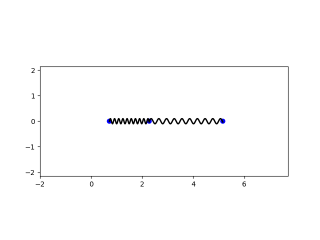
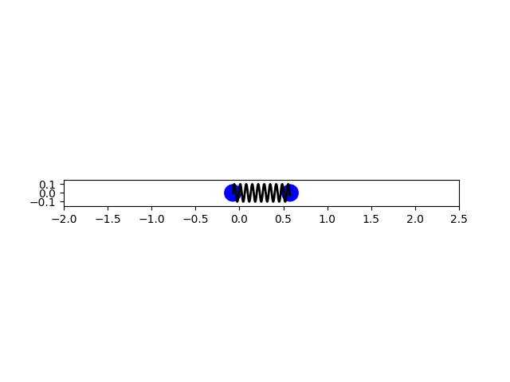

# Coupled Oscillators Simulation

[](#)
[](#license)

<p align="center">
  
</p>

A Python-based simulation framework to model and visualize linearly coupled oscillators. This repository provides:

* A **general model** for `n` damped-free oscillators with customizable masses and stiffness matrix.
* A **specific example** simulating two pendulums coupled via a spring.
* Animation outputs using **Matplotlib**'s `FuncAnimation`.

---

## Table of Contents

* [Features](#features)
* [Installation](#installation)
* [Usage](#usage)

  * [General System](#general-system-of-n-coupled-oscillators)
  * [Two Coupled Pendulums](#two-coupled-pendulums-with-a-spring)
* [Project Structure](#project-structure)
* [License](#license)
* [Contact](#contact)

---

## Features

* **Flexible**: Supports any number of oscillators (`n`), arbitrary masses, and coupling matrix.
* **Robust**: Automatically corrects negative eigenvalues to ensure positive definiteness.
* **Visual**: Real-time animation of blocks and springs.
* **Extensible**: Easily adapt to other physical systems (e.g., LC circuits).

---

## Installation

1. Clone the repository:

   ```bash
   git clone https://github.com/yourusername/coupled-oscillators.git
   cd coupled-oscillators
   ```
2. (Optional) Create a virtual environment:

   ```bash
   python -m venv venv
   source venv/bin/activate  # on Linux/Mac
   venv\Scripts\activate    # on Windows
   ```
3. Install dependencies:

   ```bash
   pip install -r requirements.txt
   ```

> **Requirements**: Python 3.8 or newer, `numpy`, `matplotlib`.

---

## Usage

### General System of `n` Coupled Oscillators

1. Open `coupled_oscillators.py`.
2. Define number of oscillators `n`, `masses`, and a symmetric `k_matrix`.
3. Set initial `displacements` and `velocities` arrays.
4. Run:

   ```bash
   python coupled_oscillators.py
   ```
5. The animation window will display the oscillators in motion.

```python
# Example snippet
n = 3
masses = [1.0, 1.0, 1.0]
k_matrix = np.array([[2,1,0],[1,3,1],[0,1,2]])
initial_displacements = [-1,0,1]
initial_velocities = [0,1,0]
plot_animation(n, masses, k_matrix, initial_displacements, initial_velocities)
```

### Two Coupled Pendulums with a Spring

This example shows two pendulums of length `l` and mass `m`, coupled by a spring constant `k`:

```python
# two_pendulums.py
n = 2
m, l, g, k = 1.0, 1.0, 9.81, 50.0
k_matrix = np.array([[k/m + g/l, -k/m],[-k/m, k/m + g/l]])
initial_displacements = [0.1, -0.1]
initial_velocities = [0, 0]
plot_animation(n, [m]*n, k_matrix, initial_displacements, initial_velocities)
```

<p align="center">
  
</p>

---

## Project Structure

```plaintext
├── figures/                       # Sample animation snapshots
│   ├── Figure_1.png
│   └── Figure_2.png
├── src/
│   ├── coupled_oscillators.py     # General n-oscillator simulation
├── requirements.txt               # Python dependencies
├── report.tex                     # Report
└── README.md                      # This file
```

## License

This project is licensed under the MIT License - see the [LICENSE](LICENSE) file for details.

---

## Contact

Abolfazl Mokhtari - [abolfazlmokhtari6356@gmail.com](mailto:abolfazlmokhtari6356@gmail.com)

Project Link: [https://github.com/abolfazl-mokhtari/coupled-oscillators](https://github.com/abolfazl-mokhtari/coupled-oscillators)
